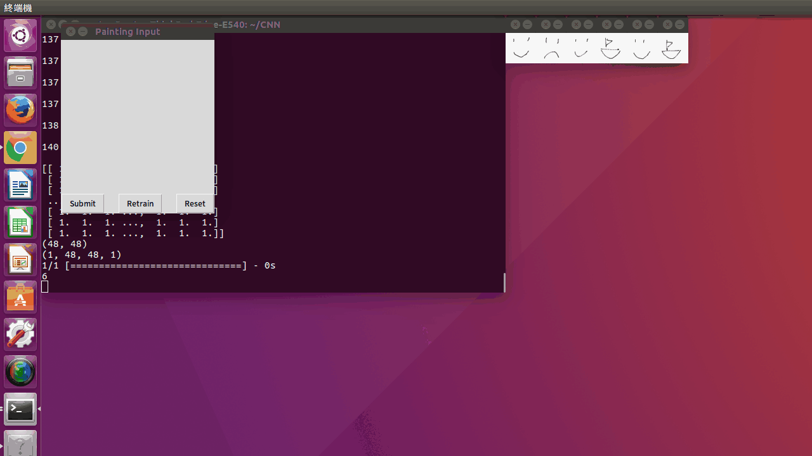
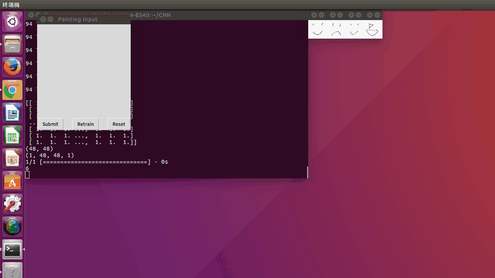
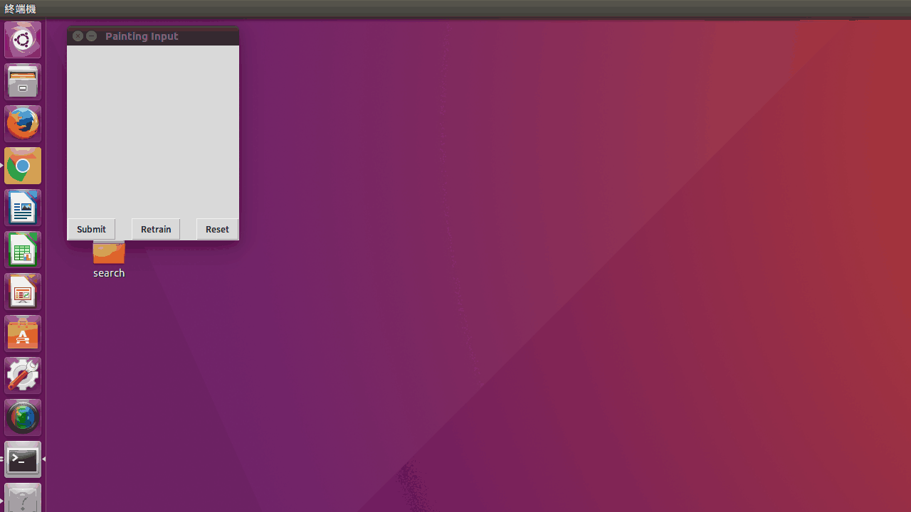

# DrawingAndKeras
A simple program to recognize simple drawings.
Use Keras's CNN(Convolutional Neural Network) to classify the drawings.
It needs Python3 and following packages to run properly:

`Theano, Keras, pillow, numpy, spicy, tkinter, time, h5py and matplotlib.`

Try `pip` to install them:

And what's more, Theano can take advantage of NVIDIA's CUDA APIs and NVIDIA's cuDNN to boost the progress of training.
###How to run?
`python CNN_GUI.py`
###How to use?
#####First. Train it!
Press the `Retrain` button. The program will begin to learn how to recognize and classify drawings by using the drawings it recognized before.

#####Secend. Time to Graffiti!
Draw something on the board. Once you done, press `Submit` button. The program will try to find the answer.

#####Third. If it makes mistakes
Label it!

#####Fourth. If you want to reset the board
Press `Reset` button.

